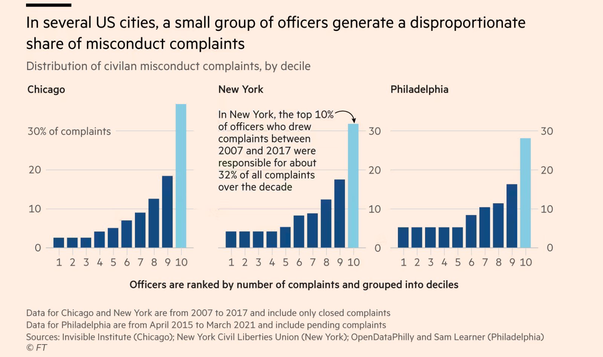
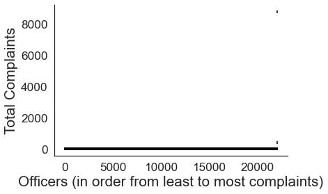

# Does a small share of the police force account for one third of complaints?

[This FT article](https://www.ft.com/content/141182fc-7727-4af8-a555-5418fa46d09e) from 2012 claimed that police complaints in various US cities were disproportionally concentrated among the top 10% of police officers with the most complaints. During my fellowship in 2022, I was asked to replicate these findings using a dataset of police complaints in London Metropolitan Police (MET), obtained by a freedom of information request. The code in this repository demonstrates some statistical reasons for why it is impossible to drawn these kinds of conclusions from this type of data.

> This figure from the [2012 FT article](https://www.ft.com/content/141182fc-7727-4af8-a555-5418fa46d09e) illustrates the main claim of the article – that a small proportion of police officers accumulate a disproportionate number of complaints. In this repository, I will show through simulation and analysis that this cannot be inferred from this data.

## Simulation and exploratory data analysis

Data inspection

 

Firstly, as a sanity check, we will simply visualise the data to ensure there are no issues that stand out. The function `inspect_data` in `utils.py` orders the officers based on how many complaints they received. After simply plotting each officer's total number of complaints, we can see that there is a very unrealistic outlier with over 8000 complaints over the past 5 years. This means subject 122060 was, on average, receiving 4 complaints per day for the past 5 years – which seems impossible. The second most complained officer ID is called 'Organisational', which is unlikely to refer to a single officer. We will therefore exclude these officer IDs from the rest of the analysis.

## Major statistical issues

dafkjhajk

## Summary

sfkalkjdglkj
