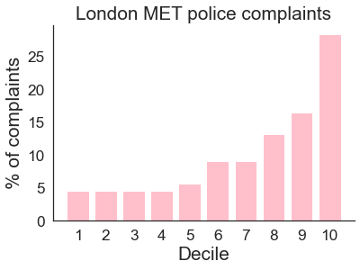
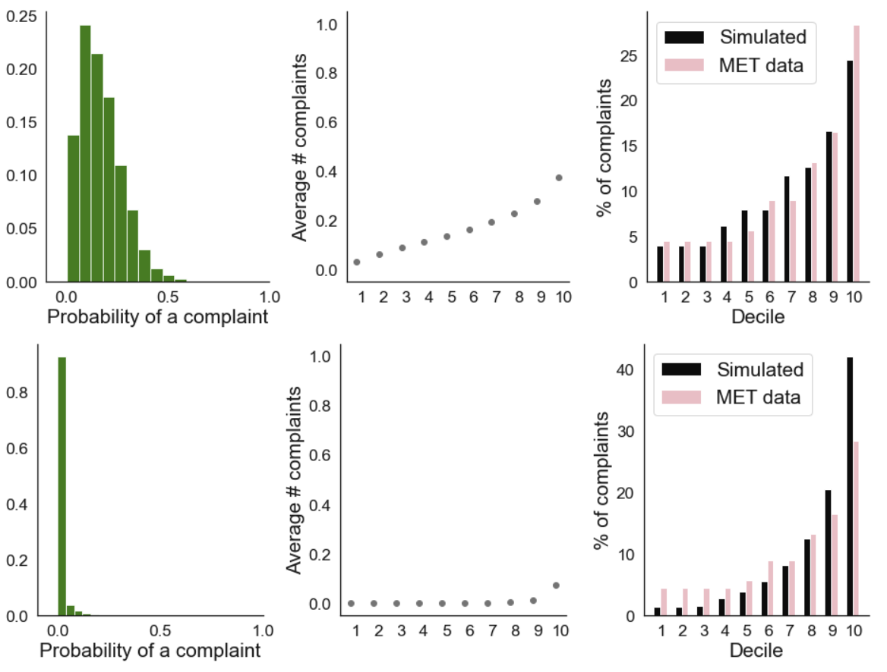
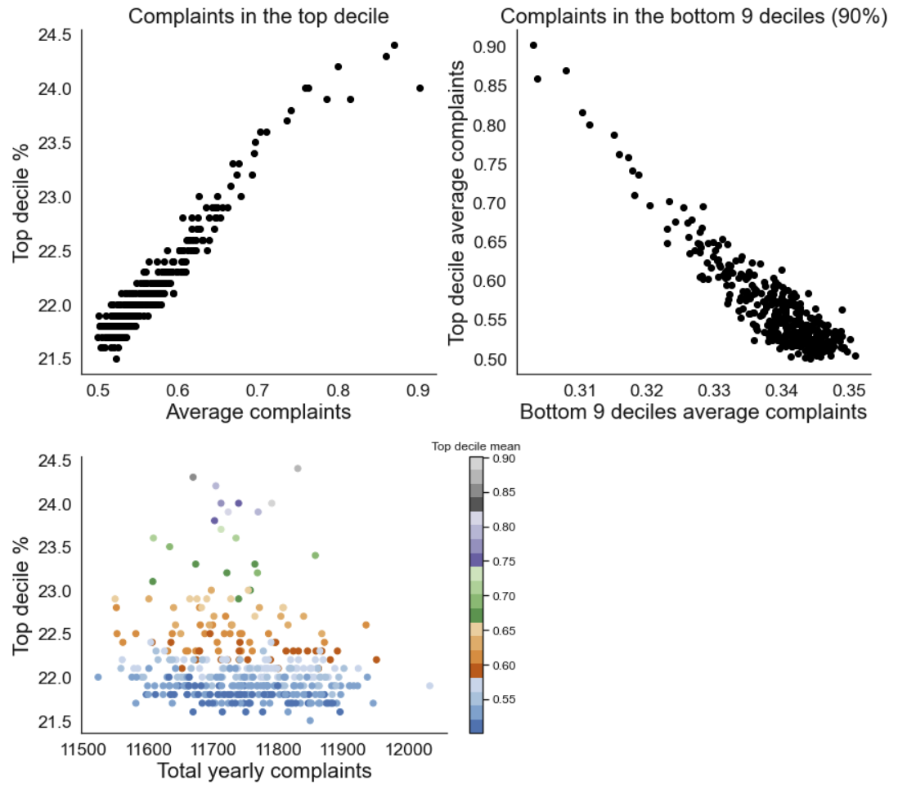
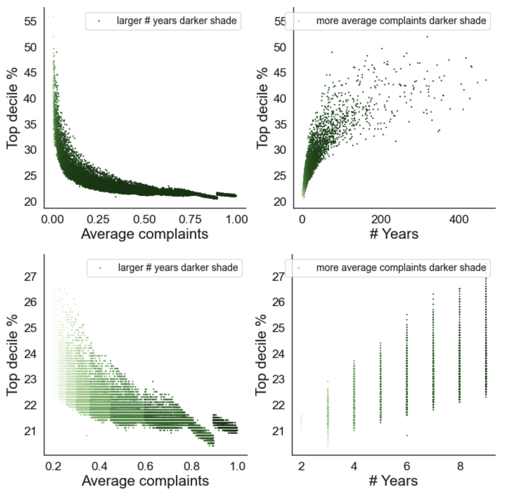

# Does a small share of the police force account for one third of complaints?

[This FT article](https://www.ft.com/content/141182fc-7727-4af8-a555-5418fa46d09e) from 2012 claimed that police complaints in various US cities were disproportionally concentrated among the top 10% of police officers with the most complaints. During my fellowship in 2022, I was asked to replicate these findings using a dataset of police complaints in London Metropolitan Police (MET), obtained by a freedom of information request. The code in this repository demonstrates some statistical reasons for why it is impossible to drawn these kinds of conclusions from this type of data.

> This figure from the [2012 FT article](https://www.ft.com/content/141182fc-7727-4af8-a555-5418fa46d09e) illustrates the main claim of the article – that a small proportion of police officers accumulate a disproportionate number of complaints. In this repository, I will show through simulation and analysis that this cannot be inferred from this data.

## Simulation and exploratory data analysis

Data inspection

 

Firstly, as a sanity check, we will simply visualise the data to ensure there are no issues that stand out. The function `inspect_data` in `utils.py` orders the officers based on how many complaints they received. After simply plotting each officer's total number of complaints, we can see that there is a very unrealistic outlier with over 8000 complaints over the past 5 years. This means subject 122060 was, on average, receiving 4 complaints per day for the past 5 years – which seems impossible. The second most complained officer ID is called 'Organisational', which is unlikely to refer to a single officer. We will therefore exclude these officer IDs from the rest of the analysis.

Officer complaints ranked by decile

 

Here, I will group the MET officers into deciles as in the original article. It looks like we are more or less replicating the results that top 10% of the officers are accruing a disproportionate number of complaints. As mentioned earlier, we do not have a baseline for how many cases each officer worked on so this plot is confounded and should not be interpreted as 'top % of officers are disproportionally more likely to receive complaints'. For the next step, let's assume (although this is likely to be an oversimplification) that each officer has a uniform probability of receiving a complaint.

Simulation for a case where all officers have an equal probability of receiving a complaint

 

We can quickly find out that there are [32,493 officers](https://en.wikipedia.org/wiki/Metropolitan_Police) at the London MET, and from our dataset we can calculate that there were 58,147 complaints received in the past 5 years. So, on average, each year there were 0.36 complaints per officer. With these two numbers, we can simulate the simplest case where each officer has an equal probability of receiving a complaint by drawing samples from a Poisson distribution (because complaints are discrete events) with an expected number of 0.36 per year.

> Even if all officers were equally likely to receive a complaint the resulting distribution would look exponential.
  
In simulated data where all officers have an equal chance of getting a complaint the top decile is responsible for a lower number of complaints (20%) than in the real data (28%) but the distribution still looks exponential. This suggests that there is a major problem in interpreting these kinds of plots.

Simulating a case where the probabilities of receiving a comlaint in each decile are proportional to the ratios in % of complaints received in each decile in MET data

 

Now let's simulate a case where each decile of police officers has a different chance of receiving a complaint. Here, the probability distribution is proportional to the distribution of the % of complaints in each decile in the MET data. Officers in the top decile will on average have at least one complaint a year. The resulting simulated distribution starts to match the real data much more closely. This suggests it is in fact possible that some officers are more likely to receive a complaint than others (this can be thought of as some model of [preferential attachment](https://en.wikipedia.org/wiki/Preferential_attachment)).

  

Simulating a case where the probabilities of receiving a comlaint in each decile are proportional to the ratios in % of complaints received in each decile in MET data

 

Now let's simulate a case where each decile of police officers has a different chance of receiving a complaint. Here, the probability distribution is proportional to the distribution of the % of complaints in each decile in the MET data. Officers in the top decile will on average have at least one complaint a year. The resulting simulated distribution starts to match the real data much more closely. This suggests it is in fact possible that some officers are more likely to receive a complaint than others (this can be thought of as some model of [preferential attachment](https://en.wikipedia.org/wiki/Preferential_attachment)).

  

Simulating complaint data with beta distributions

 

As we do not know the baseline number of cases each officer has worked on from our data, we cannot actually assume that the probabilities of receiving a comlaint in each decile are proportional to the ratios in % of complaints received in each decile. So let's model some other probability distributions of complaints across officers and see what the resulting % of complaints per decile plot looks like. We can use a beta distribution (with shape parameters a and b) to generate various probability distributions of complaints.

  

Simulating complaint data with probability distributions with an average probability of complaints matching the data

 

We can now look at the possible % values of complaints accounted by the top decile under various probability distributions. First, we can select values from simulations that would approximate some of the known conditions in our data - it took 5 years for the MET to achieve a total # of complaints 58129 and there was an average of 0.36 complaints per officer. We can see that under these conditions higher averages in complaints in the the top decile will result in the top percentile accounting for a higher proportion of all complaints.

However, this is accompanied by the fact that complaints in the bottom 90 % of the officers will decrease as the number of average complaints in the top decile increases.

  

The % of complaints received by the top decile increases exponentially as the average complaints in the police force decreases

 

Finally, let's plot the % of complaints accounted by the top decile from all of our simulated probability distributions of complaints. Overall, there is a negative exponential relathionship between % of complaints received in the top decile and the rates of police complaints.

This means that high % of cases accounted by the top decile can also mean that the police force is in fact receiving fewer complaints.

  

## Major statistical issues and Summary

ajkfhadkhkjga
